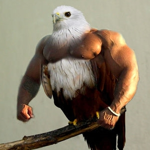

## REPS ON REPS ON REPS

Using `express-quotes` app as a guide, build your own application from scratch.

Your app should have the following routes:

* `/` - Root route, would welcome user and introduce the app
* `/birds` - route to render all birds in the database
* `/birds/nyc` - route to render all birds in nyc
* `/birds/nyc/:type` - would render information about pigeon in nyc.

You will need to create a mock database file containing an object with the data about birds. What properties do you need? Base it off the routes provided above.
> Note: Feel free to use `lorem ipsum` for bird description 😉 

#### Feeling awesome? 💪 HERE is **Bonus** 🎉:
* add some pictures of birds and display it on the page when a certain endpoint is hit.
